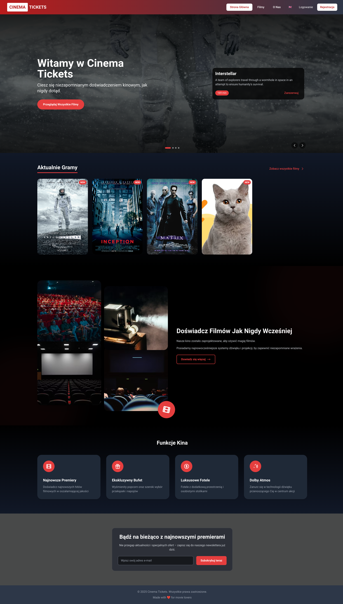
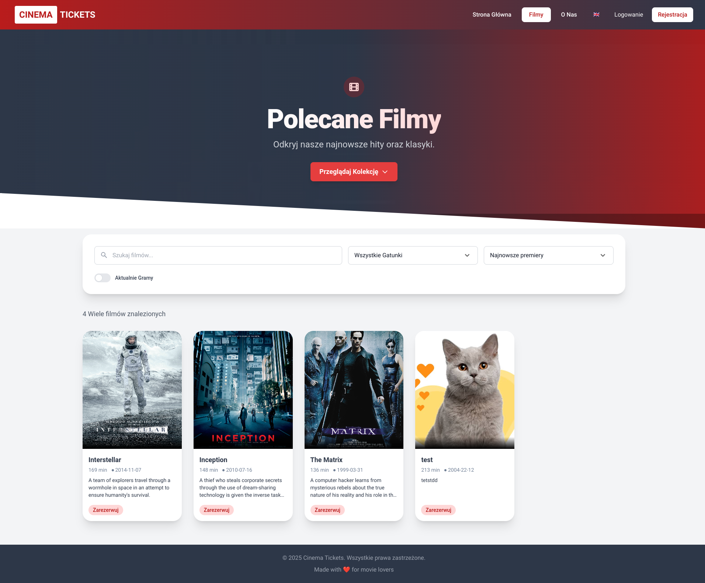
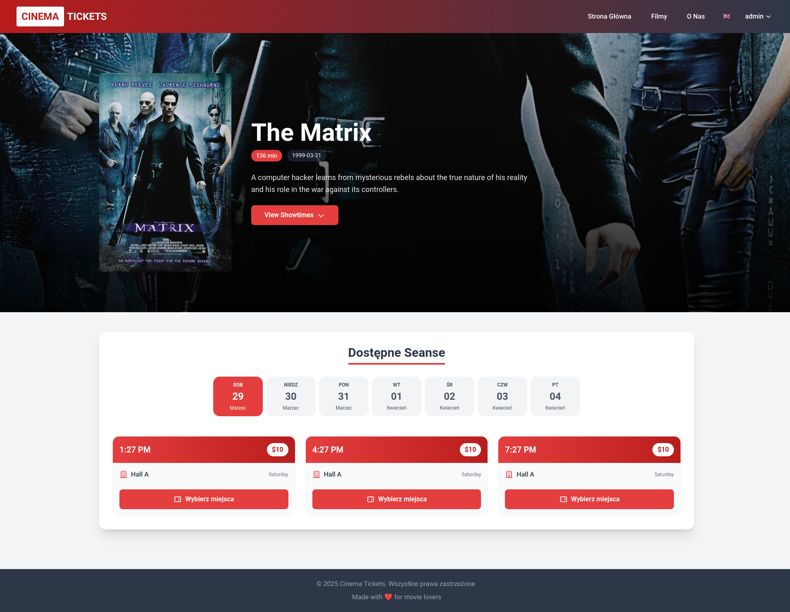
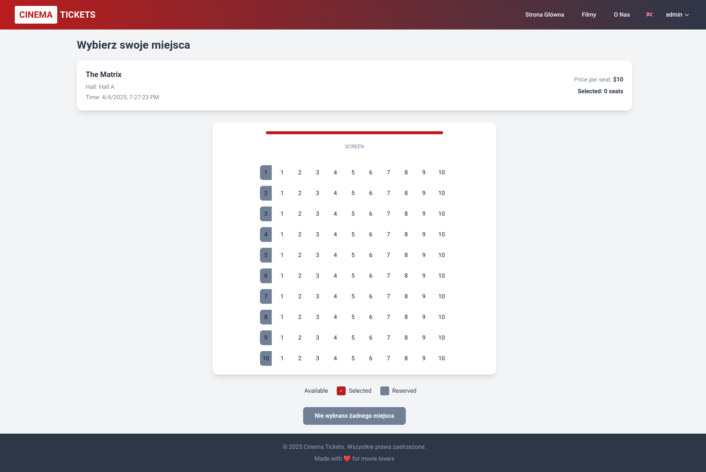
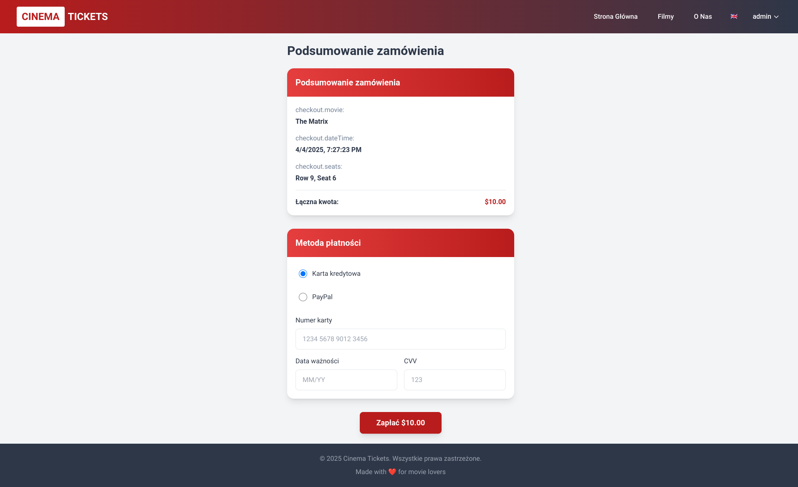
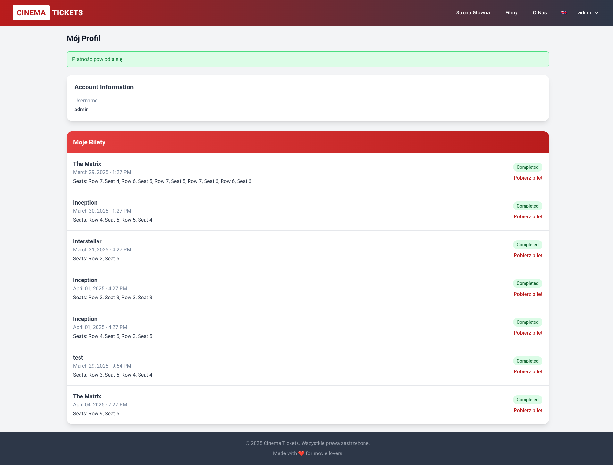
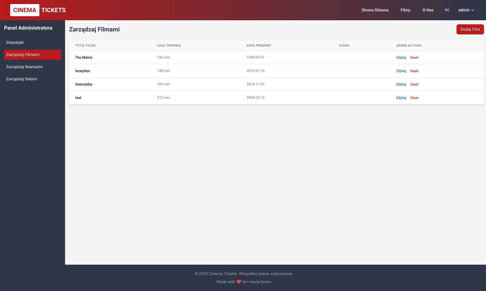

# Cinema Ticket Sales System

[](https://fastapi.tiangolo.com/)
[](https://reactjs.org/)
[](https://www.python.org/)
[](https://www.sqlalchemy.org/)
[](https://tailwindcss.com/)
[](https://opensource.org/licenses/MIT)
## Overview

The Cinema Ticket Sales System is a comprehensive full-stack web application designed to streamline the process of selling and managing cinema tickets online. This platform caters to both movie-goers seeking a convenient booking experience and cinema administrators needing efficient tools to manage screenings, theaters, and sales.

<p align="center">
  
</p>

## Table of Contents

- Key Features
- Architecture
- Technology Stack
- Database Design
- Authentication and Authorization
- Core Workflows
- Installation and Setup
- Project Structure
- API Documentation
- Multilingual Support
- Screenshots
- Future Enhancements

## Key Features

### Customer Experience

- **Movie Browsing**: Explore current and upcoming movie listings with detailed information
- **Advanced Filtering**: Search movies by title, genre, or release date
- **Interactive Seat Selection**: Visual seat map with real-time availability status
- **Multi-seat Booking**: Reserve up to 5 seats per transaction
- **Secure Checkout**: Protected payment processing
- **Digital Tickets**: Download PDF tickets with QR codes for easy verification
- **User Profiles**: View booking history and manage personal information
- **Responsive Design**: Optimized experience across desktop, tablet, and mobile devices
- **Multilingual Support**: Available in English and Polish

### Administrative Capabilities

- **Comprehensive Dashboard**: Real-time sales analytics and key performance indicators
- **Movie Management**: Add, edit, and remove movies from the catalog
- **Showtime Scheduling**: Set up and manage screening times and associated theaters
- **Theater Configuration**: Define and modify theater layouts and seating arrangements
- **Ticket Verification**: Tools for validating tickets at entry points
- **Sales Reporting**: Generate detailed reports on ticket sales, popular movies, and revenue

## Architecture

The Cinema Ticket Sales System follows a modern client-server architecture with clean separation of concerns:

```
┌───────────────────┐      HTTP/REST      ┌───────────────────┐
│                   │<------------------>│                   │
│  React Frontend   │       JSON         │  FastAPI Backend  │
│  (SPA)            │                    │                   │
│                   │                    │                   │
└───────────────────┘                    └────────┬──────────┘
                                                  │
                                                  │ SQL
                                                  ▼
                                         ┌───────────────────┐
                                         │    SQLite/SQL     │
                                         │    Database       │
                                         │                   │
                                         └───────────────────┘
```

- **Frontend**: Single Page Application (SPA) built with React, providing a seamless, responsive user interface
- **Backend**: RESTful API built with FastAPI, handling business logic, data validation, and database operations
- **Database**: SQLite for development (easily replaceable with PostgreSQL for production), storing all application data
- **Authentication**: JWT (JSON Web Tokens) based authentication flow for secure user sessions

## Technology Stack

### Frontend Technologies

- **React 18**: JavaScript library for building the user interface with efficient rendering through virtual DOM
- **React Router 6**: Declarative routing for React applications, enabling navigation without page reloads
- **Context API**: State management solution for sharing data across component tree without prop drilling
- **Tailwind CSS**: Utility-first CSS framework for rapid UI development with consistent design
- **Axios**: Promise-based HTTP client for making API requests to the backend
- **date-fns**: Modern JavaScript date utility library for formatting and manipulating dates
- **JWT Decode**: Tool for decoding JWT tokens to access user information

### Backend Technologies

- **Python 3.10+**: Core programming language with modern features like async/await support
- **FastAPI**: High-performance, easy-to-use framework for building APIs with automatic OpenAPI documentation
- **Pydantic**: Data validation and settings management using Python type annotations
- **SQLAlchemy**: SQL toolkit and Object-Relational Mapping (ORM) for database interactions
- **SQLite**: Self-contained, serverless SQL database engine (easily replaceable with PostgreSQL)
- **JWT**: JSON Web Tokens for secure authentication between client and server
- **Uvicorn**: ASGI server for running FastAPI applications with high performance
- **ReportLab**: PDF generation library for creating digital tickets
- **QRCode**: Python library for generating QR codes embedded in tickets

### Development Tools

- **npm/yarn**: Package managers for JavaScript dependencies
- **Virtual Environment**: Python's venv for isolated development environments
- **Git**: Version control system for code management

## Database Design

The system uses a relational database model with the following core entities:

### Entity Relationship Diagram

```
┌─────────┐       ┌──────────┐       ┌─────────┐
│  Users  │       │  Movies  │       │  Halls  │
└────┬────┘       └────┬─────┘       └────┬────┘
     │                 │                  │
     │                 │                  │
     │                 ▼                  │
     │            ┌──────────┐            │
     │            │ Showtimes │◄───────────┘
     │            └────┬─────┘
     │                 │
     ▼                 │
┌──────────┐           │
│Reservations│◄────────┘
└────┬─────┘
     │
     │
     ▼
┌───────────────┐     ┌───────┐
│ReservationSeats│─────► Seats │
└───────────────┘     └───────┘
```

### Key Tables

1. **Users**: Store customer and admin accounts
   - Fields: id, username, email, hashed_password, is_admin

2. **Movies**: Store film information
   - Fields: id, title, description, duration, release_date, poster_url, rating

3. **Halls**: Define theater halls and their capacity
   - Fields: id, name, capacity, rows, seats_per_row

4. **Seats**: Individual seats in each hall
   - Fields: id, hall_id, row, number

5. **Showtimes**: Scheduled movie screenings
   - Fields: id, movie_id, hall_id, start_time, end_time, price

6. **Reservations**: Customer bookings
   - Fields: id, user_id, showtime_id, payment_status, created_at

7. **ReservationSeats**: Junction table linking reservations to seats
   - Fields: id, reservation_id, seat_id

## Authentication and Authorization

The system implements a secure JWT-based authentication flow:

1. **Registration**: User creates an account with username, email, and password
2. **Login**: User provides credentials and receives a JWT token
3. **Token Storage**: JWT is stored in the browser's localStorage
4. **Authorization**: Protected routes/actions check for valid JWT before granting access
5. **Role-Based Access**: Special admin endpoints are restricted to users with admin privileges
6. **Token Expiration**: JWTs expire after a configurable period for security

## Core Workflows

### Ticket Booking Process

1. **Browse Movies**: User explores available movies
2. **Select Showtime**: User chooses a specific screening
3. **Seat Selection**: Interactive seat map displays available/taken seats
4. **Checkout**: User reviews order and proceeds to payment
5. **Payment Processing**: Secure payment transaction
6. **Ticket Generation**: System generates PDF ticket with QR code
7. **Confirmation**: User receives confirmation and can download ticket

### Admin Movie Management

1. **Movie Listing**: Admin views all movies in the system
2. **Add/Edit Movies**: Admin can create new or modify existing movie entries
3. **Schedule Showtimes**: Admin assigns movies to specific halls at scheduled times
4. **Price Configuration**: Admin sets ticket prices for each showtime
5. **Analytics**: Admin views sales data and performance metrics

## Installation and Setup

### Prerequisites

- Python 3.10 or higher
- Node.js 14 or higher
- npm or yarn

### Backend Setup

1. Clone the repository:
   ```bash
   git clone https://github.com/your-username/cinema-site.git
   cd cinema-site/backend
   ```

2. Create and activate a virtual environment:
   ```bash
   python -m venv venv
   source venv/bin/activate  # On Windows: venv\Scripts\activate
   ```

3. Install dependencies:
   ```bash
   pip install -r requirements.txt
   ```

4. Set up environment variables:
   ```bash
   cp .env.example .env
   # Edit .env file with your preferred settings
   ```

5. Run database migrations and seed data:
   ```bash
   python seed.py
   ```

6. Start the backend server:
   ```bash
   uvicorn main:app --reload
   ```

7. The backend API will be available at: `http://localhost:8000`
   - API Documentation: `http://localhost:8000/docs`

### Frontend Setup

1. Navigate to the frontend directory:
   ```bash
   cd ../frontend
   ```

2. Install dependencies:
   ```bash
   npm install
   # or
   yarn install
   ```

3. Start the development server:
   ```bash
   npm start
   # or
   yarn start
   ```

4. The frontend application will be available at: `http://localhost:3000`

### Default Test Accounts

After seeding the database, the following accounts are available for testing:

- **Admin User**: 
  - Username: `admin`
  - Password: `admin123`

- **Regular User**:
  - Username: `user`
  - Password: `user123`

## Project Structure

```
cinema-site/
├── backend/                # Python FastAPI backend
│   ├── __pycache__/        # Python bytecode cache
│   ├── cinema.db           # SQLite database file
│   ├── crud.py             # Database operations
│   ├── database.py         # Database connection setup
│   ├── main.py             # Application entry point & API routes
│   ├── models.py           # SQLAlchemy data models
│   ├── requirements.txt    # Python dependencies
│   ├── schemas.py          # Pydantic schemas for validation
│   ├── seed.py             # Database seeding script
│   └── ticket_generator.py # PDF ticket generation
│
├── frontend/               # React frontend
│   ├── node_modules/       # JavaScript dependencies
│   ├── public/             # Static files
│   ├── src/                # Source code
│   │   ├── components/     # Reusable UI components
│   │   ├── context/        # React contexts (Auth, Language)
│   │   ├── pages/          # Page components
│   │   ├── services/       # API service layer
│   │   ├── translations/   # Language files
│   │   ├── App.js          # Root component
│   │   └── index.js        # Entry point
│   ├── package.json        # npm/yarn configuration
│   └── tailwind.config.js  # Tailwind CSS configuration
│
├── .gitignore              # Git ignore file
├── README.md               # Project documentation
└── dokumentacja_systemu.md # Polish system documentation
```

## API Documentation

The backend provides an interactive OpenAPI documentation interface at `/docs` endpoint, which includes:

- **Authentication Endpoints**:
  - `POST /token`: Get JWT token with credentials
  - `POST /users/`: Register a new user

- **Movie Endpoints**:
  - `GET /movies/`: List all movies
  - `GET /movies/{movie_id}`: Get movie details
  - `POST /movies/`: Add a new movie (admin only)

- **Showtime Endpoints**:
  - `GET /showtimes/`: List all showtimes
  - `POST /showtimes/`: Create a new showtime (admin only)
  
- **Reservation Endpoints**:
  - `GET /showtime/{showtime_id}/seats`: Get available seats
  - `POST /reservations/`: Create a new reservation
  - `PATCH /reservations/{reservation_id}`: Update reservation status
  
- **Ticket Endpoints**:
  - `GET /reservations/{reservation_id}/ticket`: Download ticket PDF

- **Admin Endpoints**:
  - `GET /admin/statistics`: Get sales statistics

## Multilingual Support

The application offers a full multilingual experience with support for:

- English (default)
- Polish

The translation system uses a custom implementation based on JSON dictionaries for each supported language, accessible through a LanguageContext in React.

## Screenshots

### Home Page

*The welcoming homepage that showcases currently playing and upcoming movies with an intuitive navigation bar.*

### Movie Listings

*Browse all available movies with filtering options by genre, release date, and search functionality.*

### Movie Details

*Detailed view of a selected movie showing synopsis, duration, ratings, and available showtimes.*

### Seat Selection

*Interactive seat map allowing users to select up to 5 seats per booking with real-time availability indicators.*

### Checkout Process

*Secure payment processing page with order summary and payment method selection.*

### User Profile

*Personal user dashboard showing booking history, saved payment methods, and account settings.*

### Admin Dashboard

*Comprehensive management interface for administrators with sales analytics and content management tools.*


### Mobile Responsive Design

*The application is fully responsive and provides an optimal experience on mobile devices.*

## Future Enhancements

- **Payment Gateway Integration**: Connect to popular payment processors
- **Email Notifications**: Send booking confirmations and reminders
- **Social Media Login**: Enable authentication via Google, Facebook, etc.
- **Recommendation Engine**: Suggest movies based on user preferences
- **Progressive Web App**: Enable offline functionality and installability
- **PostgreSQL Migration**: Move from SQLite to PostgreSQL for production
- **Docker Containerization**: Simplify deployment with containerization

## License

This project is licensed under the MIT License - see the [LICENSE](LICENSE) file for details.
